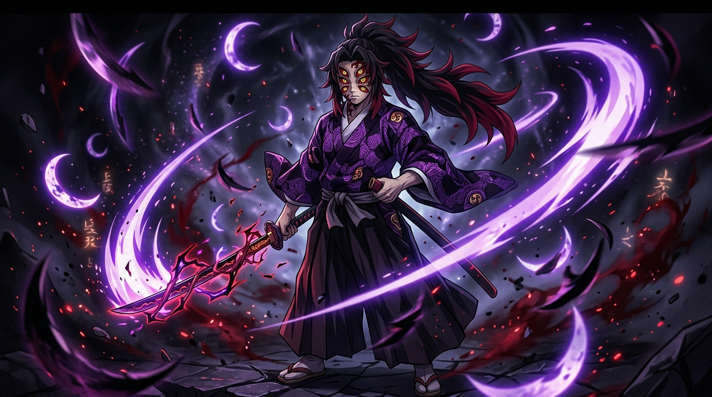
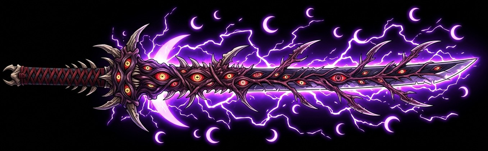
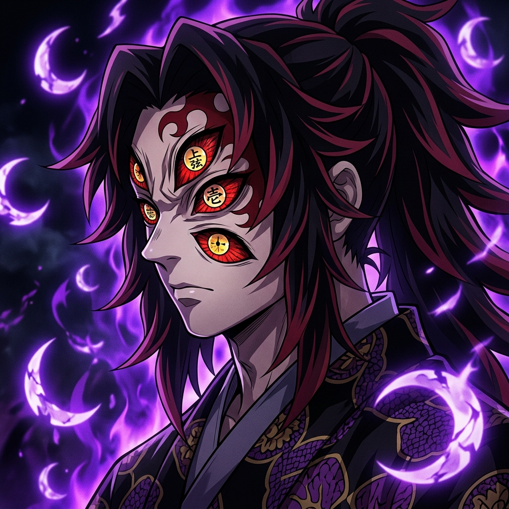
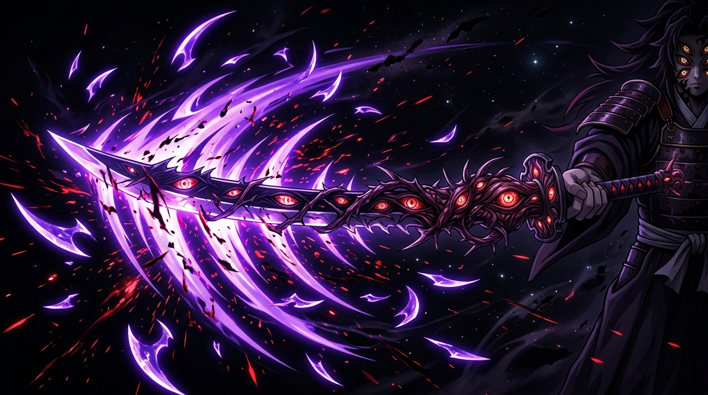

<div align="center">

  <!-- Kokushibo Top Wave Header -->
  

  <!-- Main Cinematic Anime Banner -->
  <a href="https://github.com/fazril299">
    
  </a>

  <br/><br/>

  <!-- Dynamic Typing SVG -->
  <a href="https://github.com/fazril299">
    
  </a>

  <br/>

  <!-- Upper Moon Rank Badges -->
  <p align="center">
    
    
    
    
  </p>

  <!-- Social & Summoning Links -->
  <p align="center">
    <a href="https://linkedin.com/in/fazriel-muliawan" target="_blank">
      
    </a>
    <a href="mailto:fazrilkece258@gmail.com">
      
    </a>
    <a href="https://github.com/fazril299">
      
    </a>
  </p>

</div>

<br/>

<!-- Kokushibo Katana Divider -->
<div align="center">
  
</div>

<br/>

### 👁️ 「上弦の壱」 • THE CHRONICLE OF THE MOON SWORDSMAN

<table>
  <tr>
    <td width="38%" align="center" valign="middle">
      
      <br/><br/>
      <strong>Michikatsu Tsugikuni // 黒死牟</strong><br/>
      <sub><em>"Be thankful for the code... Never be arrogant. Even after four hundred years, refine the technique until every cut is invisible."</em></sub>
    </td>
    <td width="62%" valign="top">
      <h3>🌙 The Philosophy of Absolute Precision</h3>
      <p>
        I am <strong>Fazriel Muliawan</strong>, wielding the title of <strong>Upper Rank One</strong> in the realm of Frontend Engineering. Like Kokushibo relentlessly striving for eternal perfection beyond human limitations, I engineer digital interfaces with lethal precision, fluid momentum physics, and modern luxury aesthetics.
      </p>
      <ul>
        <li>🌑 <strong>True Identity:</strong> Frontend Architect & Creative Developer</li>
        <li>⚔️ <strong>Primary Art:</strong> React 19, Modern Vite Architecture & Framer Motion</li>
        <li>🌌 <strong>Secret Technique:</strong> Natural Momentum Physics via <code>lenis</code> & zero-latency animations</li>
        <li>🩸 <strong>Demon Mark:</strong> Obsession with pixel perfection, clean code, and edge caching</li>
        <li>📍 <strong>Territory:</strong> Indonesia (Available for Global High-Stakes Projects)</li>
      </ul>
      <p>
        <em>"You opened a path to reach further heights... and you abandoned it? In this domain, we push the boundaries of web craftsmanship until eternity."</em>
      </p>
    </td>
  </tr>
</table>

<br/>

<!-- Kokushibo Katana Divider -->
<div align="center">
  
</div>

<br/>

### 🌙 「月の呼吸」 • THE 16 FORMS OF MOON BREATHING (TECH ARSENAL)

Each technique represents a specialized doctrine in my development stack:

<div align="center">
  <br/>

  <!-- Skill Icons Dark Palette -->
  <a href="https://skillicons.dev">
    
  </a>

  <br/><br/>
</div>

| Form | Technique Name | Digital Mastery |
| :---: | :--- | :--- |
| **壱ノ型** | **First Form: Dark Moon, Evening Palace** *(闇月・宵の宮)* | **Core Languages:** Semantic HTML5, Modern CSS3, JavaScript (ESNext), TypeScript |
| **伍ノ型** | **Fifth Form: Moon Spirit Calamitous Eddy** *(月魄災渦)* | **Frameworks:** React 19, Next.js, Vite Ecosystem, Tailwind CSS |
| **陸ノ型** | **Sixth Form: Perpetual Night, Lonely Moon** *(常夜孤月・無間)* | **Motion & Dynamics:** Framer Motion, Lenis Smooth Scroll, Three.js, Lucide Icons |
| **拾肆ノ型** | **Fourteenth Form: Catastrophe, Tenman Crescent Moon** *(兇変・天満繊月)* | **Forge & Infrastructure:** Figma, Git, GitHub Actions, VS Code, Vercel Edge CDN |

<br/>

<!-- Kokushibo Katana Divider -->
<div align="center">
  
</div>

<br/>

### ⚔️ 「虚哭神去」 • KYOKUKOKUKAMUI: THE FLESH BLADE

<div align="center">
  
  <p align="center">
    <em>"A blade born from demonic flesh, sprouting branching blades with chaotic crescent moons that strike without warning."</em>
  </p>
</div>

<br/>

<!-- Kokushibo Katana Divider -->
<div align="center">
  
</div>

<br/>

### 📊 「血鬼術」 • UPPER MOON COMBAT METRICS

<div align="center">

  <!-- GitHub Stats Card -->
  <a href="https://github.com/fazril299">
    
  </a>
  &nbsp;
  <!-- Top Languages Card -->
  <a href="https://github.com/fazril299">
    
  </a>

  <br/><br/>

  <!-- Streak Stats Card -->
  <a href="https://github.com/fazril299">
    
  </a>

</div>

<br/>

<!-- Kokushibo Katana Divider -->
<div align="center">
  
</div>

<br/>

### 📜 「契約の掟」 • THE SAMURAI CONTRACT SCRIPT

```typescript
import { MoonBreathing, UpperRankOne } from "@infinity-castle/core";

export class KokushiboDeveloper implements UpperRankOne {
  readonly samuraiName: string = "Fazriel Muliawan";
  readonly title: string = "Upper Moon One • Frontend Sorcerer";
  readonly breathingStyle: string = "Tsuki no Kokyū (Moon Breathing)";
  readonly formsMastered: number = 16;
  readonly corePhilosophy: string = "Perfection is carved through endless iterations.";

  public executeCrescentCut(): string {
    return "Crafting ultra-smooth luxury interfaces where every animation lands like a lethal crescent arc.";
  }

  public summonCollaboration(): void {
    console.log("Ready to forge legendary web experiences. Reach out via LinkedIn or Email.");
  }
}

const demonEngineer = new KokushiboDeveloper();
demonEngineer.summonCollaboration();
```

<br/>

<!-- Kokushibo Katana Divider -->
<div align="center">
  
</div>

<br/>

<div align="center">

  ### 🩸 「召喚」 • SUMMON THE UPPER MOON

  Have a challenging project, luxury design to build, or want to talk frontend architecture?<br/>
  *Step into the Infinity Castle and initiate contact.*

  <br/>

  <a href="mailto:fazrilkece258@gmail.com">
    
  </a>
  &nbsp;
  <a href="https://linkedin.com/in/fazriel-muliawan" target="_blank">
    
  </a>

  <br/><br/>

  <!-- Kokushibo Footer Wave -->
  

</div>
